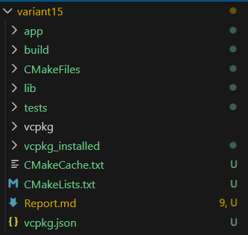
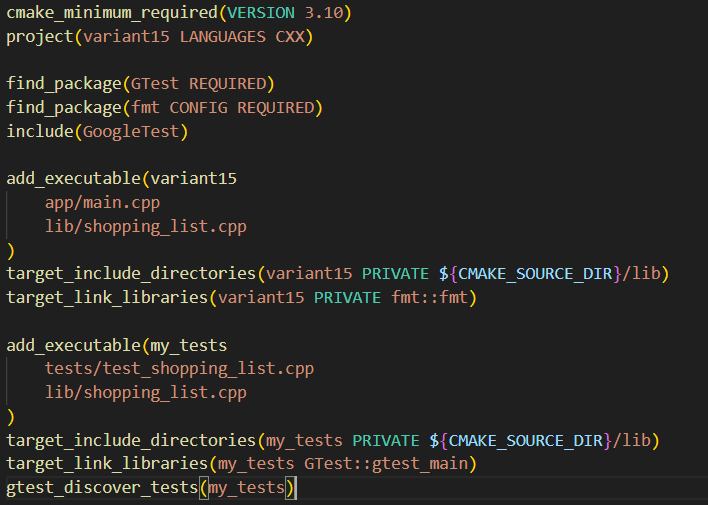
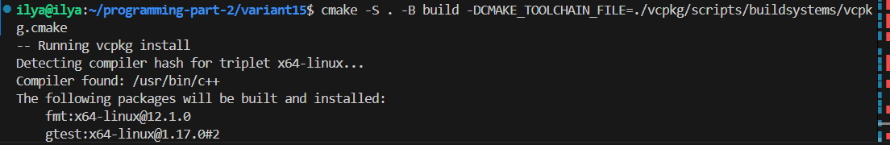
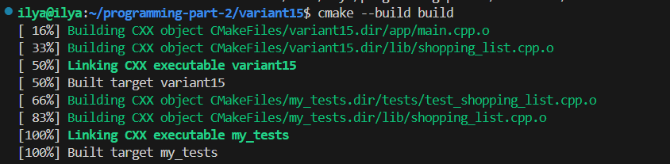
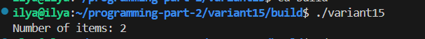
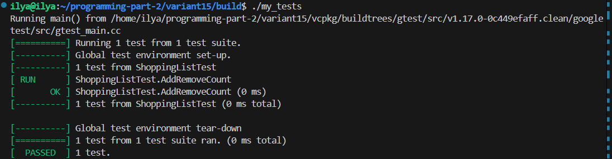
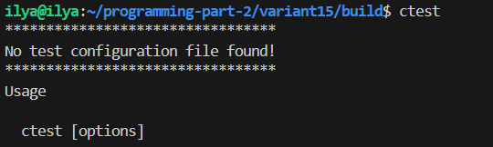
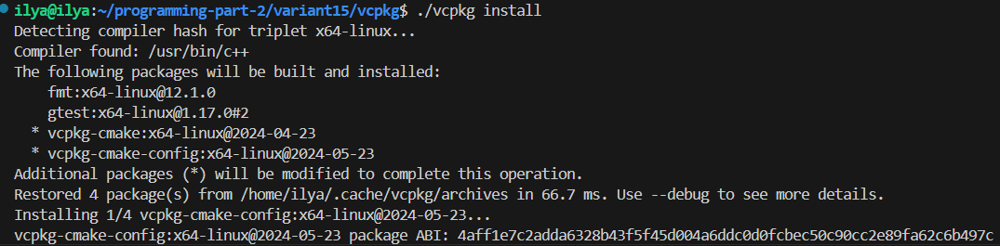

# Lab 01 — CMake

---
**Course:** Programming, Part 2  
**Institution:** NTU KhPI, Kharkiv, Ukraine  
**Student:** Illya Paralynov  
**Date:** 20.03.2026

---

## The Topic

Managing the build process of C++ projects and dependencies using CMake,
GoogleTest, a modular structure, and vcpkg.

## The Objective

To acquire practical skills in creating C++ projects, configuring the build process,
connecting custom libraries, organizing a modular structure, integrating tests, and adding
external dependencies.

## The tasks

1) create a simple executable project;
2) isolate part of the logic into a separate library;
3) add tests for the library through GoogleTest;
4) move the configuration into a modular structure through add_subdirectory();
5) connect one external library through vcpkg (the recommended choice is fmt).

## Brief Theoretical Breakdown:

CMake is a very powerful tool for generating Makefiles and building projects. it's a lot more flexible and customisable than makefile on its own, and in addition to that, it works well with C++.

## Tools description

The tools i've used include: 
Ubuntu Virtual Machine
Git
Visual Studio Code

## Implementation

```
it started from creating the basic structure, or a "skeleton" of the project. First, i made all the necessarry folders and root files as instructed by the lab document. Then, i thought on how best to implement my variant's task in C++, since it requires me to store some data, and ended up agreeing with myself on using a vector, despite the fact that we haven't used it yet. I have some little previous knowledge, and besides, information on the internet is always available. I chose a vector specifically because it has dynamic memory allocation and doesnt need setting up limits like a regular array would. After i wrote the initial library, i scrambled to make a main.cpp and some basic tests with gtest. After i finished working wit that, i started researching the CMake and how to tie it all together. I ended up opting in the modular CMake structure. Although it would cause me some headaches during the testing phase, i believe it was worth it, since such structures are very common. Parallel to the makefile, i worked on the vcpkg.json file. After everything was basically done, i had to spend a lot of time basically wrestling with the system, trying to figure out where the gtest went, how to makew the vcpkg work and wehat it even is, since the lab document doesnt go deep into it, and editing the CMake files to make it work. it was a tedious process, and the lab directory got quite bloated as a result, but now everything works as intended.
```


## Structure

```text
variant15/
├── app/
├──CMakeFiles/
├──lib/
├──tests/
├──vcpkg/
├──vcpkg_installed/
├──CMakeCache.txt
├──CMakeLists.txt
├──Report.md
├──vcpkg.json
└── build/  
```

## Main Code Fragments

```
#include <iostream>
#include "shopping_list.hpp"
#include <fmt/core.h>

int main() {
    ShoppingList list;
    list.add("Milk");
    list.add("Bread");

    fmt::print("Number of items: {}\n", list.count());
}
```

```
#include <gtest/gtest.h>
#include "shopping_list.hpp"

TEST(ShoppingListTest, AddRemoveCount) {
    ShoppingList list;
    list.add("Milk");
    list.add("Bread");
    EXPECT_EQ(list.count(), 2);

    list.remove("Milk");
    EXPECT_EQ(list.count(), 1);
}
```

```
cmake_minimum_required(VERSION 3.10)
project(variant15 LANGUAGES CXX)

find_package(GTest REQUIRED)
find_package(fmt CONFIG REQUIRED)
include(GoogleTest)

add_executable(variant15
    app/main.cpp
    lib/shopping_list.cpp
)
target_include_directories(variant15 PRIVATE ${CMAKE_SOURCE_DIR}/lib)
target_link_libraries(variant15 PRIVATE fmt::fmt)

add_executable(my_tests
    tests/test_shopping_list.cpp
    lib/shopping_list.cpp
)
target_include_directories(my_tests PRIVATE ${CMAKE_SOURCE_DIR}/lib)
target_link_libraries(my_tests GTest::gtest_main)
gtest_discover_tests(my_tests)
```

## SCreenshots










## Conclusions:

1) Such stages of CMake C++ project were completed: Structure setup, configuration, integration of extrenal libraries, build and run, testing.
2) Library files are stored in .cpp and .hpp files in the lib folder. They are connected with the CMake file via target_include_directories and targer_sources.
3) Each target can have its own sources, include paths, compile options, and linked libraries. Makes the project modular and easy to modify.
4) Gtest is a framework for testing. FetchContent is a CMake module for downloading and building dependancies. vcpkg is a package manager for C++ libraries. It helped install gtest and fmt, as well as link them.
5) During work, i encounteredt such difficulties as: lack of provided information on vcpkg, issues with vcpkg connecting to the gmake, multiple errors with toolchain, multiple fatal errors on build related to library connections.