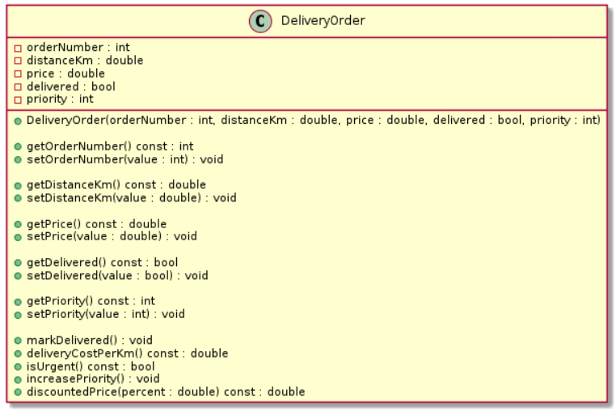

# Lab 03 — A Simple C++ Class and UML Basics


---
**Course:** Programming, Part 2  
**Institution:** NTU KhPI, Kharkiv, Ukraine  
**Student:** Illya Paralynov  
**Date:** 24.03.2026

---

## The Topic

Designing a simple C++ class with encapsulation, constructors, access methods,
and a UML class diagram in PlantUML.

## The Objective

To reinforce the basic concepts of object-oriented programming in C++, learn
how to design a simple class, represent its interface in UML, and connect the diagram
with a real implementation.

## The tasks

1) declare a class with public and private sections;
2) implement a constructor, getters, and setters;
3) distinguish between a class interface and its internal state;
4) build a UML class diagram in PlantUML syntax;
5) map attributes, methods, and access modifiers to UML notation;
6) write a small main() program to test the class;
7) analyze which getters and setters are actually useful and which weaken
encapsulation.

## Brief Theoretical Breakdown:

In C++, a class combines data and operations on that data. The main idea
of this laboratory work is not mechanical implementation of a set of functions, but
understanding the connection between:
• the internal state of an object;
• the public interface;
• class invariants;
• the UML representation of the class.

## Tools description

The tools i've used include: 
Ubuntu Virtual Machine
Git
Visual Studio Code

## Variant

```
Variant 15. DeliveryOrder
Class description. The class describes one delivery order.
Fields:
• int orderNumber
• double distanceKm
• double price
• bool delivered
• int priority
Main interface to implement:
• DeliveryOrder(int orderNumber, double distanceKm, double
price, bool delivered, int priority)
• void markDelivered()
• double deliveryCostPerKm() const
• bool isUrgent() const
• void increasePriority()
• double discountedPrice(double percent) const
Required getters and setters:
• int getOrderNumber() const, void setOrderNumber(int
PROGRAMMING. PART 2
17
value)
• double getDistanceKm() const, void setDistanceKm(double
value)
• double getPrice() const, void setPrice(double value)
• bool getDelivered() const, void setDelivered(bool value)
• int getPriority() const, void setPriority(int value)
```


## Structure

```text
lab03/
├── assets/
    └── main.cpp
├──include/
    └── lib.hpp
├──src/
    └── lib.src
├──uml/
    └── Diagram.puml
    └── Diagram.png
├──CMakeLists.txt
├──Report.md
```

## The initial UML class diagram

```
@startuml

class DeliveryOrder {
- orderNumber : int
- distanceKm : double
- price : double
- delivered : bool
- priority : int

+ DeliveryOrder(orderNumber : int, distanceKm : double, price : double, delivered : bool, priority : int)

+ getOrderNumber() const : int
+ setOrderNumber(value : int) : void

+ getDistanceKm() const : double
+ setDistanceKm(value : double) : void

+ getPrice() const : double
+ setPrice(value : double) : void

+ getDelivered() const : bool
+ setDelivered(value : bool) : void

+ getPriority() const : int
+ setPriority(value : int) : void

+ markDelivered() : void
+ deliveryCostPerKm() const : double
+ isUrgent() const : bool
+ increasePriority() : void
+ discountedPrice(percent : double) const : double
}

@enduml
```

## Main Code Fragments

```
#include <iostream>
#include "lib.hpp"

int main() {
    DeliveryOrder order(101, 12.5, 250.0, false, 3);

    std::cout << "Order number: " << order.getOrderNumber() << '\n';
    std::cout << "Distance (km): " << order.getDistanceKm() << '\n';
    std::cout << "Price: " << order.getPrice() << '\n';
    std::cout << "Delivered: " << (order.getDelivered() ? "yes" : "no") << '\n';
    std::cout << "Priority: " << order.getPriority() << '\n';

    std::cout << "Cost per km: " << order.deliveryCostPerKm() << '\n';
    std::cout << "Is urgent: " << (order.isUrgent() ? "yes" : "no") << '\n';

    std::cout << "Discounted price (10%): " << order.discountedPrice(10) << '\n';

    order.increasePriority();
    std::cout << "Priority after increase: " << order.getPriority() << '\n';

    order.markDelivered();
    std::cout << "Delivered after update: " << (order.getDelivered() ? "yes" : "no") << '\n';

    return 0;
}
```

```
#pragma once

class DeliveryOrder {
public:
    DeliveryOrder(int orderNumber, double distanceKm, double price, bool delivered, int priority);
    int getOrderNumber() const; 
    void setOrderNumber(int value);
    double getDistanceKm() const;
    void setDistanceKm(double value);
    double getPrice() const; 
    void setPrice(double value);
    bool getDelivered() const;
    void setDelivered(bool value);
    int getPriority() const; 
    void setPriority(int value);

    void markDelivered();
    double deliveryCostPerKm() const;
    bool isUrgent() const;
    void increasePriority();
    double discountedPrice(double percent) const;


private:
    int orderNumber;
    double distanceKm;
    double price;
    bool delivered;
    int priority;
};
```

```
#include "lib.hpp"

DeliveryOrder::DeliveryOrder(int orderNumber, double distanceKm, double price, bool delivered, int priority)
    : orderNumber(orderNumber),
      distanceKm(distanceKm),
      price(price),
      delivered(delivered),
      priority(priority) {}

int DeliveryOrder::getOrderNumber() const {
    return orderNumber;
}

double DeliveryOrder::getDistanceKm() const {
    return distanceKm;
}

double DeliveryOrder::getPrice() const {
    return price;
}

bool DeliveryOrder::getDelivered() const {
    return delivered;
}

int DeliveryOrder::getPriority() const {
    return priority;
}

void DeliveryOrder::setOrderNumber(int value) {
    orderNumber = value;
}

void DeliveryOrder::setDistanceKm(double value) {
    distanceKm = value;
}

void DeliveryOrder::setPrice(double value) {
    price = value;
}

void DeliveryOrder::setDelivered(bool value) {
    delivered = value;
}

void DeliveryOrder::setPriority(int value) {
    priority = value;
}

void DeliveryOrder::markDelivered() {
    delivered = true;
}

double DeliveryOrder::deliveryCostPerKm() const {
    if (distanceKm == 0)
        return 0;
    return price / distanceKm;
}

bool DeliveryOrder::isUrgent() const {
    return priority >= 5;
}

void DeliveryOrder::increasePriority() {
    priority++;
}

double DeliveryOrder::discountedPrice(double percent) const {
    return price * (1.0 - percent / 100.0);
}
```


## SCreenshots



## Testing

    No particular testing was made, aside from basic make commands.


## Unnecessary getters and Setters

```
Some getters and setters may be considered unnecessary.

For example:

The delivery status can be changed using the markDelivered() method.
Priority changes can be handled through the increasePriority() method instead of a setter in some cases or deleted entirely. I would say that change of prirority is an unnecessary feature art all.
```


## Conclusions:
