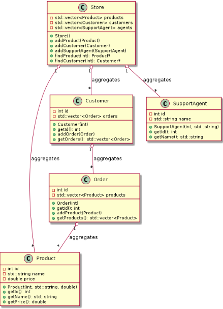
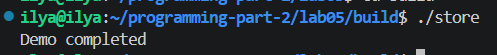
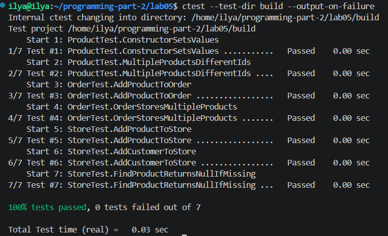

# Lab 05 — Relationships Between Classes: Aggregation

---
**Course:** Programming, Part 2  
**Institution:** NTU KhPI, Kharkiv, Ukraine  
**Student:** Illya Paralynov
**Date:** 03.31.2026  

---

## Task Description

The purpose of this laboratory work is to practice modeling class relationships
in which one object contains or references other objects without taking full ownership
of their lifetime. Students are expected to distinguish aggregation from composition,
design a small domain model, represent it as a UML class diagram, and implement the
corresponding C++ project.


## Brief theoretical notes

```
In object-oriented design, classes rarely exist in isolation. Real systems are built
from interacting objects, and one of the key design tasks is to determine what kind of
relationship exists between them. At this stage of the course, students should clearly
distinguish three related but different notions: association, aggregation, and composition.
Association is the most general relationship. It only states that objects of one class
are connected with objects of another class in some meaningful way. For example, a
Student may use a Library, or a Passenger may book a Flight. Such a relationship
does not by itself say anything about ownership or lifetime.
Aggregation is a weaker whole–part relationship. One class acts as a logical container, organizer, or manager for a group of other objects, but those objects may still
exist independently. For example, a Department may aggregate Professor objects,
and a Library may aggregate Book objects in its catalog. In the conceptual model, the
aggregated objects are connected to the aggregator, but their lifetime is not strictly bound
to it.
Composition is a stronger form of containment. In composition, the contained
objects are considered integral parts of the whole, and their lifetime is usually controlled
by the owner. If the whole object is destroyed, its composed parts are also destroyed as
part of the same conceptual entity. This distinction is important both for modeling and
for implementation.
```

## Variant specification

```text
Variant 15: Online Store Platform
Objective: Implement an object-oriented model of an online store platform using
aggregation.
Required classes:
• Store
• Product
• Customer
• Order
• SupportAgent
Implementation requirements:
1. Determine which class plays the role of the aggregator and which classes may
exist independently.
2. Implement constructors, accessors, and behavior methods appropriate for the
domain.
3. Add methods for managing aggregated objects (for example, add, remove, assign,
register, or attach).
4. Ensure that aggregation is reflected both in code and in the UML class diagram.
5. Implement a demonstration scenario in main.cpp.
6. Create unit tests for the key classes and their interaction logic.
7. Store declarations in public/, implementations in private/, tests in tests/.
8. Build the project using CMakeLists.txt.
Suggested aggregation focus: The Store aggregates products and support agents.
Orders reference customers and products while remaining separate domain objects.
```

## Justification of the chosen aggregation relationships

```
I chose the simplest aggregation loadout i could think of. it's not overly complex, and it gets the job done, while beeing compliant with the lab's required connection.
```


### UML DIagram




### CMake project structure


```bash
cmake_minimum_required(VERSION 3.20)
project(online_store_platform LANGUAGES CXX)

include(FetchContent)

FetchContent_Declare(
    googletest
    GIT_REPOSITORY https://github.com/google/googletest.git
    GIT_TAG v1.17.0
)

FetchContent_MakeAvailable(googletest)

enable_testing()

add_library(store_lib
    private/Product.cpp
    private/SupportAgent.cpp
    private/Customer.cpp
    private/Order.cpp
    private/Store.cpp
)

target_include_directories(store_lib PUBLIC public)

target_compile_features(store_lib PUBLIC cxx_std_20)

if(MSVC)
    target_compile_options(store_lib PRIVATE /W4)
else()
    target_compile_options(store_lib PRIVATE -Wall -Wextra -Wpedantic)
endif()

add_executable(store main.cpp)

target_link_libraries(store PRIVATE store_lib)

add_executable(store_tests
    tests/test_main.cpp
    tests/test_product.cpp
    tests/test_order.cpp
    tests/test_store.cpp
)

target_link_libraries(store_tests
    PRIVATE store_lib
    GTest::gtest_main
)

include(GoogleTest)
gtest_discover_tests(store_tests)
```

### Implementation code fragments


```bash
#include "Store.hpp"

void Store::addProduct(const Product& product) {
    products.push_back(product);
}

void Store::addSupportAgent(const SupportAgent& agent) {
    agents.push_back(agent);
}

void Store::addCustomer(const Customer& customer) {
    customers.push_back(customer);
}

Product* Store::findProduct(int id) {
    for (int i = 0; i < (int)products.size(); i++) {
        if (products[i].getId() == id) {
            return &products[i];
        }
    }
    return nullptr;
}

Customer* Store::findCustomer(int id) {
    for (int i = 0; i < (int)customers.size(); i++) {
        if (customers[i].getId() == id) {
            return &customers[i];
        }
    }
    return nullptr;
}
```

## Fragments of a unit test code


```bash
#include <gtest/gtest.h>
#include "Store.hpp"
#include "Product.hpp"
#include "Customer.hpp"

TEST(StoreTest, AddProductToStore) {
    Store store;
    Product product(1, "Laptop", 1200.0);

    store.addProduct(product);

    Product* found = store.findProduct(1);

    ASSERT_NE(found, nullptr);
    EXPECT_EQ(found->getId(), 1);
}

TEST(StoreTest, AddCustomerToStore) {
    Store store;
    Customer customer(10);

    store.addCustomer(customer);

    Customer* found = store.findCustomer(10);

    ASSERT_NE(found, nullptr);
    EXPECT_EQ(found->getId(), 10);
}

TEST(StoreTest, FindProductReturnsNullIfMissing) {
    Store store;

    Product* found = store.findProduct(999);

    EXPECT_EQ(found, nullptr);
}
```

## An example of running the application



The goal of this lab is to...

In this lab, I completed the following tasks:

TBD

---

## An example of unit tests




---

### Conclusions

```
I find this lab to be the most complicated one so far. Multiple classes, gtest, a uml, and all the classes need to be comprehensibly connected? This took me quite a while. But after researching the topic online, looking through some documents and revisiting the lecture recording, i managed to complete the lab with satisfying results.
```
