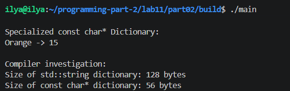
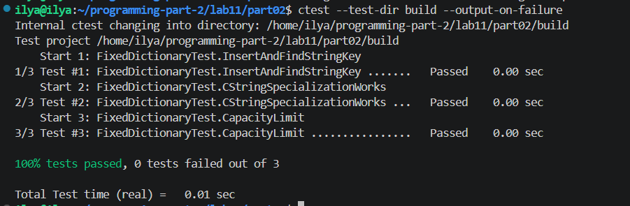

# Lab 11 — Class Templates in C++

---
**Course:** Programming, Part 2  
**Institution:** NTU KhPI, Kharkiv, Ukraine  
**Student:** Illya Paralynov 
**Date:** 04/30/2026

---

## The topic, purpose, and assignment statement

The purpose of this laboratory work is to practice the design and implementation
of class templates in C++, including ordinary class templates, templates with multiple
parameters, non-type template parameters, full or partial specialization, and the basic
analysis of template instantiations produced by the compiler. The work is designed for an
extended laboratory session of approximately four academic hours and is organized as a
single assignment consisting of two parts.


## Short theoretical notes

A class template describes a family of related classes rather than a single class. The
exact class is formed only after the compiler substitutes concrete template arguments. In
practice, a class template may parameterize the stored type, the number of elements, the
policy of processing, or other structural properties. This mechanism makes it possible to
implement reusable data abstractions while still preserving static type safety.

Specialization is another important mechanism. A full specialization provides a
separate implementation for one exact set of template arguments. A partial specialization
adapts a template for an entire family of arguments, such as pointer types or arrays of
a certain form. In educational examples, specialization is useful because it reveals that
generic design is not only about writing one universal class, but also about refining its
behavior when one category of types requires different semantics.

Class templates are also closely connected with the compilation model of C++. The
compiler must see the full definition of a class template and of its member functions
at the point where an instantiation is required. For this reason, template definitions
are usually placed in header files. When different concrete instantiations are used, the
compiler creates distinct types, and those types may differ in layout, member availability,
and overload resolution results

## The selected variant

Variant 5: Exam Result Table
Objective: Implement a class-template-based model of a fixed row of exam results.
Part 1 – Core template class:
• Implement ExamRow<T, N> that stores one row of results in a raw array.
• Provide setScore(), getScore(), sum(), countPassed(), and best().
• Use the class with at least one integral and one floating-point type.
Part 2 – Extension and specialization:
• Implement ColumnInfo<IndexType, ValueType> or another two-parameter
metadata class for column descriptions.
• Add a full specialization of ColumnInfo<int, std::string> or another exact
combination that is meaningful in the domain.
• Use the compiler-oriented investigation to show the instantiated metadata type
and the instantiated row type.
Template focus: same-type storage, two-parameter templates, and an exact full
specialization

Common requirements for this variant:
1. Use raw arrays for fixed-capacity storage where the class holds a sequence of
elements.
1. Implement a demonstration scenario in main.cpp.
2. Add unit tests for the main operations and for the extension introduced in Part 2.
3. Include the mandatory compiler-oriented investigation described above.
4. Store declarations and template definitions in files visible to the compiler at the
point of instantiation.

## Part descriptions

```
In part 1 of this lab work, i had to build a generic dictionary system. it consists of 2 templates, one of which stores 1 "pair" of data, a key and value, and the second template stores multiple such entries in a static, fixed size array. technically, i only made 1 dictionary, but it supports multiple data types, not just strings, which makes it generic.
```

```
In part 2, i have expanded this system by adding something called "specialisation". I use "const char*" for storing the entries, but if compared, this data type takes the data adress indtead of the actual value. So, if i were to compare, say, "Car" and "Car", 2 clearly same entries, the result would be falser, since they take up different places in data. So, in this context, specialisation means we make a custom instruction in the template, in case it uses a specific data type. So i made partial specialisation in part 2, so that the template is able to compare the value of the "key" fields, and not their memory adress. The implementation is partial, because i haven't done the same to the "value" field.
```

## Justification

To make the dictionary generic, i chose the following: Key and Value fields allow different data types, while N defines a fixed capacity to ensure efficient static memory allocation without dynamic containers, as per lab requirements.

## Raw arrays

Raw arrays were used because the lab requirements restrict the use of STL containers. This enforces manual management of storage, and helps demonstrate fixed-capacity data structures.

## fragments of the implementation code

```
#ifndef DICTIONARYENTRY_HPP
#define DICTIONARYENTRY_HPP

template <typename Key, typename Value>
class DictionaryEntry {
private:
    Key key_;
    Value value_;

public:
    DictionaryEntry() = default;

    DictionaryEntry(const Key& key, const Value& value)
        : key_(key), value_(value) {}

    const Key& getKey() const {
        return key_;
    }

    const Value& getValue() const {
        return value_;
    }

    void setValue(const Value& value) {
        value_ = value;
    }
};

#endif
```

```
#ifndef FIXEDDICTIONARY_HPP
#define FIXEDDICTIONARY_HPP

#include "DictionaryEntry.hpp"
#include <cstddef>

template <typename Key, typename Value, std::size_t N>
class FixedDictionary {
private:
    DictionaryEntry<Key, Value> entries_[N];
    std::size_t currentSize_;

public:
    FixedDictionary()
        : currentSize_(0) {}

    bool insert(const Key& key, const Value& value) {
        if (currentSize_ >= N) {
            return false;
        }

        for (std::size_t i = 0; i < currentSize_; ++i) {
            if (entries_[i].getKey() == key) {
                entries_[i].setValue(value);
                return true;
            }
        }

        entries_[currentSize_] = DictionaryEntry<Key, Value>(key, value);
        ++currentSize_;
        return true;
    }

    bool containsKey(const Key& key) const {
        for (std::size_t i = 0; i < currentSize_; ++i) {
            if (entries_[i].getKey() == key) {
                return true;
            }
        }
        return false;
    }

    const Value* findValue(const Key& key) const {
        for (std::size_t i = 0; i < currentSize_; ++i) {
            if (entries_[i].getKey() == key) {
                return &entries_[i].getValue();
            }
        }
        return nullptr;
    }

    std::size_t size() const {
        return currentSize_;
    }

    constexpr std::size_t capacity() const {
        return N;
    }
};

#endif
```

```
#ifndef DICTIONARYENTRY_HPP

#include <cstring>

template <typename Key, typename Value>
class DictionaryEntry {
private:
    Key key_;
    Value value_;

public:
    DictionaryEntry() = default;

    DictionaryEntry(const Key& key, const Value& value)
        : key_(key), value_(value) {}

    const Key& getKey() const {
        return key_;
    }

    const Value& getValue() const {
        return value_;
    }

    void setValue(const Value& value) {
        value_ = value;
    }

    bool keyEquals(const Key& otherKey) const {
        return key_ == otherKey;
    }
};


template <typename Value>
class DictionaryEntry<const char*, Value> {
private:
    const char* key_;
    Value value_;

public:
    DictionaryEntry() = default;

    DictionaryEntry(const char* key, const Value& value)
        : key_(key), value_(value) {}

    const char* getKey() const {
        return key_;
    }

    const Value& getValue() const {
        return value_;
    }

    void setValue(const Value& value) {
        value_ = value;
    }

    bool keyEquals(const char* otherKey) const {
        return std::strcmp(key_, otherKey) == 0;
    }
};

#endif
```

```
#ifndef FIXEDDICTIONARY_HPP
#include "DictionaryEntry.hpp"
#include <cstddef>

template <typename Key, typename Value, std::size_t N>
class FixedDictionary {
private:
    DictionaryEntry<Key, Value> entries_[N];
    std::size_t currentSize_;

public:
    FixedDictionary()
        : currentSize_(0) {}

    bool insert(const Key& key, const Value& value) {
        for (std::size_t i = 0; i < currentSize_; ++i) {
            if (entries_[i].keyEquals(key)) {
                entries_[i].setValue(value);
                return true;
            }
        }

        if (currentSize_ >= N) {
            return false;
        }

        entries_[currentSize_] = DictionaryEntry<Key, Value>(key, value);
        ++currentSize_;
        return true;
    }

    bool containsKey(const Key& key) const {
        for (std::size_t i = 0; i < currentSize_; ++i) {
            if (entries_[i].keyEquals(key)) {
                return true;
            }
        }
        return false;
    }

    const Value* findValue(const Key& key) const {
        for (std::size_t i = 0; i < currentSize_; ++i) {
            if (entries_[i].keyEquals(key)) {
                return &entries_[i].getValue();
            }
        }
        return nullptr;
    }

    std::size_t size() const {
        return currentSize_;
    }

    constexpr std::size_t capacity() const {
        return N;
    }
};

#endif
```

## Fragments of the unit tests

```
#include <gtest/gtest.h>
#include <string>

#include "FixedDictionary.hpp"


TEST(FixedDictionaryTest, InsertAndFind) {
    FixedDictionary<std::string, int, 5> dict;

    EXPECT_TRUE(dict.insert("Apple", 10));
    EXPECT_TRUE(dict.insert("Banana", 20));

    EXPECT_TRUE(dict.containsKey("Apple"));
    EXPECT_TRUE(dict.containsKey("Banana"));
    EXPECT_FALSE(dict.containsKey("Orange"));

    const int* value = dict.findValue("Banana");
    ASSERT_NE(value, nullptr);
    EXPECT_EQ(*value, 20);
}


TEST(FixedDictionaryTest, UpdateExistingKey) {
    FixedDictionary<std::string, int, 5> dict;

    dict.insert("Apple", 10);
    dict.insert("Apple", 50);

    EXPECT_EQ(dict.size(), 1);

    const int* value = dict.findValue("Apple");
    ASSERT_NE(value, nullptr);
    EXPECT_EQ(*value, 50);
}


TEST(FixedDictionaryTest, CapacityLimit) {
    FixedDictionary<int, std::string, 2> dict;

    EXPECT_TRUE(dict.insert(1, "One"));
    EXPECT_TRUE(dict.insert(2, "Two"));

    EXPECT_FALSE(dict.insert(3, "Three"));
    EXPECT_EQ(dict.size(), 2);
}


TEST(FixedDictionaryTest, EmptyLookup) {
    FixedDictionary<std::string, int, 3> dict;

    EXPECT_FALSE(dict.containsKey("Nothing"));
    EXPECT_EQ(dict.findValue("Nothing"), nullptr);
}
```

```
#include <gtest/gtest.h>
#include <string>

#include "FixedDictionary.hpp"

TEST(FixedDictionaryTest, InsertAndFindStringKey) {
    FixedDictionary<std::string, int, 3> dict;

    EXPECT_TRUE(dict.insert("Apple", 10));
    EXPECT_TRUE(dict.containsKey("Apple"));

    const int* value = dict.findValue("Apple");
    ASSERT_NE(value, nullptr);
    EXPECT_EQ(*value, 10);
}

TEST(FixedDictionaryTest, CStringSpecializationWorks) {
    FixedDictionary<const char*, int, 3> dict;

    EXPECT_TRUE(dict.insert("Orange", 15));
    EXPECT_TRUE(dict.insert("Grape", 30));

    EXPECT_TRUE(dict.containsKey("Orange"));
    EXPECT_TRUE(dict.containsKey("Grape"));

    const int* value = dict.findValue("Orange");
    ASSERT_NE(value, nullptr);
    EXPECT_EQ(*value, 15);
}

TEST(FixedDictionaryTest, CapacityLimit) {
    FixedDictionary<int, int, 2> dict;

    EXPECT_TRUE(dict.insert(1, 100));
    EXPECT_TRUE(dict.insert(2, 200));
    EXPECT_FALSE(dict.insert(3, 300));
}
```

## Compiler Investigation

Commands: 
    clang++ -std=c++20 -Iinclude -Xclang -ast-dump -fsyntax-only main.cpp > ast_dump.txt
    clang++ -std=c++20 -Iinclude -Xclang -fdump-record-layouts -c main.cpp > layouts.txt

    Unfortunately i wasn't able to pick out data from the ast_dump. It appears either broken, or i am doing something wrong. 
I did include the files in this folder, in case they are ever needed.

## An example of running the application



## an example of running the unit tests




### Observations and Conclusion

This lab was raher comlicated to comprehend. I got used to creating classes myself, and while the concept of templates for methods were somewhat understandable, but templates for entire classes are a rather large complex. Yet, i beieve i've grasped the subject at least moderately. 

---
