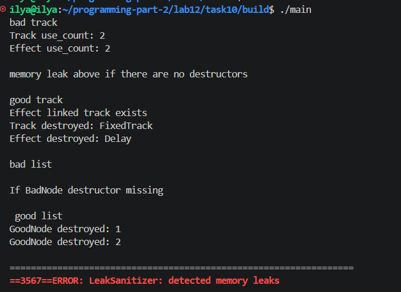

# Lab 12 — Resource Management in C++ and RAII

---
**Course:** Programming, Part 2  
**Institution:** NTU KhPI, Kharkiv, Ukraine  
**Student:** Illya Paralynov 
**Date:** 05/15/2026 

---

## The Topic

Resource management in C++ and the RAII idiom.

## The Objective

The objective of this laboratory work is to practise manual management of dynamic
resources in C++, implement classes that own memory, apply the Rule of Three and the Rule
of Five, use RAII, build a teaching wrapper SimplePtr, work with std::unique_ptr,
std::shared_ptr, and std::weak_ptr, and define custom deleters for resources that
cannot be released correctly with ordinary delete.

## Selected Variant

6:  Domain - Audio data, Array Class - SampleBuffer, Custom Deleter - audio buffer, Shared/Weak scenario - Track/Effect.

## Resources Explanation

The main managed resource here is dynamically allocated memory. SampleBuffer class has a dynamic array of Sample objects, and was used for allocating and releasing memory through various constructors and destructors. To demonstrate a custom deleter, a separate audio buffer resource was made. Since this resource required a special cleanup procedure, and ordinary delete wouldn't work, the function releaseAudioBuffer() was made to help with that.

## Ownership and RAII

RAII stands for resource acquisition and initialisation, and is a principle where resource ownership is tied to object lifetime. it was used in this laboratory work for a number of things. Ownership was also a focus during this lab. I used different models, such as exclusive ownership, shared ownership, smart pointers were also involved.

## Manual array work

With the help of the Sample type, manual work with a dynamic array was used. I made a dynamic array of Sample objects, via using new[], filled them with audio data, processed through iteration, and released using delete[].

## Shallow and Deep copy

The lab also included the difference between shallow and deep copying. A shallow copy copies only the raw pointer value, causing multiple objects to reference the same memory block, and potentially leading to problems. In opposition to that, the SampleBuffer class has a deep copying system that works through a custom copy constructor, and copy assignment operator. During such copying, a new dynamic array is allocated and all elements are copied individually.

## Rule of Three

The Rule of Three principle was implemented in the SampleBuffer class, which manages a dynamically allocated array. The principle states: if a class has a raw pointer, it must explicitly have a destructor, copy constructor, and copy assignment operator, to ensure correct resource management. The destructor releases allocated memory, while the copy operations perform deep copying to prevent shared ownership of the same memory. This is for safety measures.

## The Rule of Five

The Rule of Five is a principle that enhances the Rule of Three, by adding move rules. In the SampleBuffer class, a move constructor and move assignment operator were implemented to follow the rule of 5. Essentially, instead of copying data like usual, move operations transfer ownership of the internal pointer, and leave the moved-from object in a safe, empty state. This supposedly improves perfomance.

## SimplePtr

```
#ifndef SIMPLEPTR_H
#define SIMPLEPTR_H

#include <utility>
#include <stdexcept>

template<typename T>
class SimplePtr {
private:
    T* ptr_;

public:
    explicit SimplePtr(T* ptr = nullptr)
        : ptr_(ptr) {}

    ~SimplePtr() {
        delete ptr_;
    }

    SimplePtr(const SimplePtr&) = delete;
    SimplePtr& operator=(const SimplePtr&) = delete;

    SimplePtr(SimplePtr&& other) noexcept
        : ptr_(other.ptr_) {
        other.ptr_ = nullptr;
    }

    SimplePtr& operator=(SimplePtr&& other) noexcept {
        if (this != &other) {
            delete ptr_;
            ptr_ = other.ptr_;
            other.ptr_ = nullptr;
        }
        return *this;
    }

    T& operator*() const {
        if (!ptr_) {
            throw std::runtime_error("Dereferencing null SimplePtr");
        }
        return *ptr_;
    }

    T* operator->() const {
        if (!ptr_) {
            throw std::runtime_error("Accessing null SimplePtr");
        }
        return ptr_;
    }

    T* get() const {
        return ptr_;
    }
};

#endif
```

## unique_ptr

```
#ifndef DOMAINTYPES_H
#define DOMAINTYPES_H

#include <memory>

class Sample {
private:
    int amplitude_;
    double timestamp_;

public:
    Sample();
    Sample(int amplitude, double timestamp);

    int getAmplitude() const;
    double getTimestamp() const;
};

struct AudioBufferResource {
    int* rawData;
    size_t size;
};

void releaseAudioBuffer(AudioBufferResource* res);

class AudioBufferHandle {
private:
    std::unique_ptr<AudioBufferResource, void(*)(AudioBufferResource*)> buffer_;

public:
    explicit AudioBufferHandle(AudioBufferResource* res);

    AudioBufferHandle(const AudioBufferHandle&) = delete;
    AudioBufferHandle& operator=(const AudioBufferHandle&) = delete;

    AudioBufferHandle(AudioBufferHandle&&) noexcept = default;
    AudioBufferHandle& operator=(AudioBufferHandle&&) noexcept = default;

    AudioBufferResource* get() const;
};

#endif
```

## Custom Deleter

```
void releaseAudioBuffer(AudioBufferResource* res) {
    if (!res) return;

    std::cout << "[AudioSystem] Releasing audio buffer of size "
              << res->size << std::endl;

    delete[] res->rawData;
    delete res;
}
```

## shared_ptr

```
#ifndef DOMAINTYPES_H
#define DOMAINTYPES_H

#include <memory>
#include <string>

class Sample {
private:
    int amplitude_;
    double timestamp_;

public:
    Sample();
    Sample(int amplitude, double timestamp);

    int getAmplitude() const;
    double getTimestamp() const;
};

class Effect {
private:
    std::string effectName_;

public:
    explicit Effect(const std::string& name);

    std::string getName() const;
    void process() const;
};

class Track {
private:
    std::string trackName_;
    std::shared_ptr<Effect> effect_;

public:
    Track(const std::string& trackName,
          std::shared_ptr<Effect> effect);

    void printStatus() const;

    std::shared_ptr<Effect> getEffect() const;
};

#endif
```

## double-link

```
#ifndef DOMAINTYPES_H
#define DOMAINTYPES_H

#include <iostream>
#include <memory>
#include <string>

class BadTrack;

class BadEffect {
private:
    std::string name_;
    std::shared_ptr<BadTrack> track_;

public:
    explicit BadEffect(const std::string& name);
    ~BadEffect();

    void setTrack(std::shared_ptr<BadTrack> track);
};

class BadTrack {
private:
    std::string name_;
    std::shared_ptr<BadEffect> effect_;

public:
    explicit BadTrack(const std::string& name);
    ~BadTrack();

    void setEffect(std::shared_ptr<BadEffect> effect);
};
```
## weak_ptr

```
class Track;

class Effect {
private:
    std::string name_;
    std::weak_ptr<Track> track_;

public:
    explicit Effect(const std::string& name);
    ~Effect();

    void setTrack(std::shared_ptr<Track> track);
    void printLinkedTrack() const;
};

class Track {
private:
    std::string name_;
    std::shared_ptr<Effect> effect_;

public:
    explicit Track(const std::string& name);
    ~Track();

    void setEffect(std::shared_ptr<Effect> effect);
};

class BadNode {
public:
    int value;
    std::shared_ptr<BadNode> next;
    std::shared_ptr<BadNode> previous;

    explicit BadNode(int val);
    ~BadNode();
};

class GoodNode {
public:
    int value;
    std::shared_ptr<GoodNode> next;
    std::weak_ptr<GoodNode> previous;

    explicit GoodNode(int val);
    ~GoodNode();
};

#endif
```
## Main Demo results



## Conclusion

Memory allocation and safety, as well as resource management are very important topics in C++, or any programming language for that matter. RAII allows dynamic memory allocation to be much safer, and resource managememtnt o be much less of a headache. it reduces common mistakes programmers often make, such as double deletion or dangling pointers. I find it a very useful tool, albeit a somewhat complicated one to comprehend.
---
